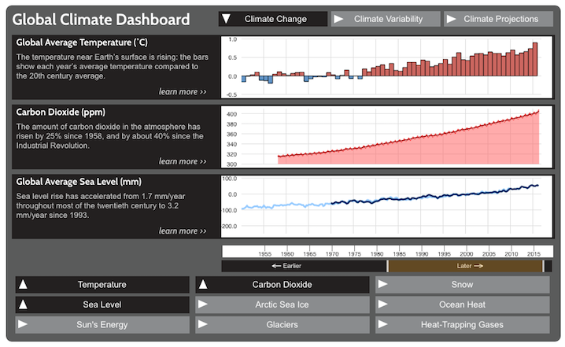
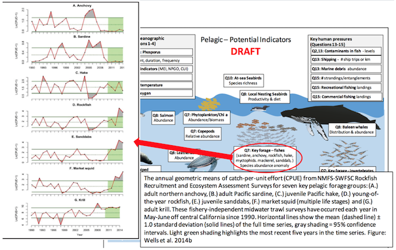

```{r setup, include=FALSE}
knitr::opts_chunk$set(echo = FALSE)
library(htmltools)
library(vembedr) # https://github.com/ijlyttle/vembedr
```

# Audience

## Tiered Presentation to Diffferent Audiences

Tiered approach based on user profiles of increasing technical capacity:

1. Initial **overview visual** of results with basic description

    Audience: low-tech, fast decision making (eg sanctuary deputy)

2. More **scientific background**

    Audience: more discernment for scientific community (marine biodiversity scientist)

3. How to generate the product with **code**

    Audience: full on geek out on how to do it yourself! (mbon analyst)

## Example: 1. **Overview Visual**



<!--
- "Global Climate Dashboard" -> "Global Marine Biodiversity Dashboard"?
- Click "learn more >>" for next step
-->

## Example: 2. **Scientific Background**


## Example: 3. **Code**

](img/ropensci-rnoaa_tutorial-sea-ice_s.png)

## 4?. **Stakeholder Views**

<!--
shiny::selectInput('sanctuary', 'Sanctuary', c('Florida Keys','Monterey Bay','Channel Islands'))
-->
Sanctuary: 
    <select id="sanctuary"><option value="Florida Keys" selected>Florida Keys</option>
<option value="Monterey Bay">Monterey Bay</option>
<option value="Channel Islands">Channel Islands</option></select>

<!--
shiny::selectInput('habitat', 'Habitat', c('Coral Reef','Rocky Intertidal','Sand Flats'))
-->
Habitat:
    <select id="habitat"><option value="Coral Reef" selected>Coral Reef</option>
<option value="Rocky Intertidal">Rocky Intertidal</option>
<option value="Sand Flats">Sand Flats</option></select>



<!--
Jenn Brown's silhouette vision. dropdown for place, on hover of animal sillhouette see time series, click to get details on data inputs and see related issues (invasives, etc) with pics of spp. need to export JPG/PDF
-->

## Social Media

- **Twitter** (internal): technical / professional
    - research publications
    - technical
- **Instagram** (public): multimedia 
    - public: videos of transects, sediment sampling, satellite launches,...
- **Facebook** (internal + public): individual scientists doing work
    - linking above w/ people tagged

